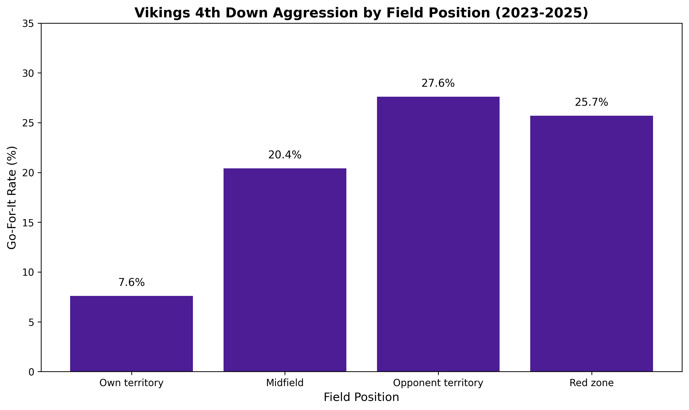
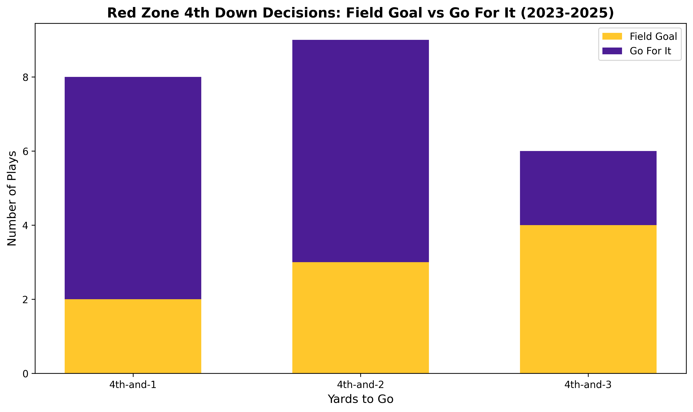

# Vikings Analytics

Analyzing Minnesota Vikings play-by-play data to answer real football questions with data.

## The Questions

*To be refined as I explore the data, but starting points:*

- How aggressive are the Vikings on 4th down compared to what the math says they should do?
- Where does the offense break down in the red zone?
- How do key receivers perform in different game situations (ahead, behind, close games)?

## Data Source

Play-by-play data from [nflverse](https://github.com/nflverse/nflverse-data) via the `nfl_data_py` Python package. Every play from every NFL game, ~400 columns of detail.

## Findings

### 4th Down Decision-Making (2023-2025)

Analyzed 375 Vikings 4th down situations across three seasons to understand how aggressive the team is in different scenarios.

**Key Finding: Vikings play conservatively in the red zone**

When faced with 4th-and-short (1-3 yards) inside the opponent's 20-yard line, the Vikings kick field goals 2.5x more often than they go for it, despite being in prime scoring position.



The data shows the Vikings are least aggressive in the red zone (25.7% go-for-it rate), even though:
- They're close to the end zone
- Short-yardage situations have decent conversion odds
- A touchdown is worth more than a field goal

**Red Zone Conservatism**

On 4th-and-1, 4th-and-2, and 4th-and-3 inside the 20:
- **47 field goal attempts**
- **19 go-for-it attempts**
- 50% conversion rate when they do go for it (7 of 14 converted)



**What This Means**

The Vikings are leaving points on the table by prioritizing guaranteed field goals over potential touchdowns in high-value situations. Analytics-driven teams are more aggressive in these spots, treating 4th-and-short as an opportunity rather than a risk.

---

## Data Source

Play-by-play data from [nflverse](https://github.com/nflverse/nflverse-data) via the `nfl_data_py` Python package.

## Tech Stack

- **Python 3.12** - Data acquisition, analysis, visualization
- **PostgreSQL 18** - Data storage and SQL analysis
- **pandas** - Data manipulation
- **matplotlib** - Charts
- **SQLAlchemy** - Database connectivity

## Project Structure
vikings-analytics/
├── pull_data.py              # Download play-by-play data from nflverse
├── load_to_db.py             # Load data into PostgreSQL
├── create_views.sql          # Create analysis views
├── analyze_fourth_down.py    # Run 4th down analysis
├── visualize_fourth_down.py  # Generate charts
├── fourth_down_aggression.png
└── red_zone_fourth_down.png


## How to Run

1. **Pull data:**
   ```bash
   python pull_data.py

POSTGRES_PASSWORD=yourpassword python load_to_db.py
psql -U postgres -d vikings_analytics -f create_views.sql
POSTGRES_PASSWORD=yourpassword python analyze_fourth_down.py
POSTGRES_PASSWORD=yourpassword python visualize_fourth_down.py

